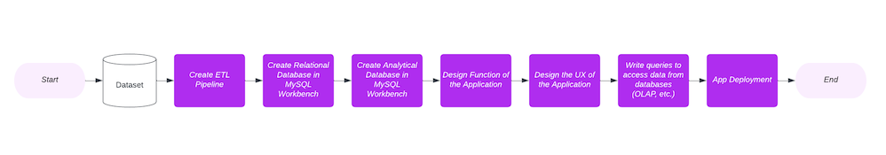

# Apple Music Database Management System

A project that constructs a system with relational database and data warehouse for Apple Music Data and builds a App with GUI to access the database management system.


## Demo

Operational System Demo:
https://youtu.be/-5545FEd0h4

Analytical System Demo:
https://youtu.be/2vx7gYjQJxE


## Skills
Python, SQL, MySQL, GUI, Data Warehousing


## Data Source
The data source about Apple Music trasaction data and user music preferece data is from this source:
https://github.com/lerocha/chinook-database
## Methodology



## Schema

#### Relational Schema


#### Analytical Schema (Data Warehouse)


## Run Locally

Clone the project

```bash
  git clone https://github.com/manyuzhang1996/Apple-Music-Database-Management-System.git
```


## Contact
Manyu Zhang (zhangmanyuzmy@gmail.com)
